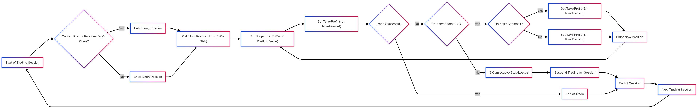

# TSMOM Trading Strategy — Multi-Asset Backtesting

A session-aware **Time-Series Momentum (TSMOM)** strategy backtested across Gold (XAUUSD), Bitcoin (BTCUSD), and WTI Crude Oil using minute-level price data.

Built as part of the ASIM course at the University of Cologne.



## Strategy Design

The strategy trades intraday momentum relative to the previous session's closing price, with three key mechanisms:

- **Session-based entries** — trades are evaluated independently across Asian, London, and US sessions, each with defined open/close windows
- **Multi-attempt scaling** — up to 3 entry attempts per session with increasing take-profit targets (1x, 2x, 3x base risk)
- **Percentage-based position sizing** — 1% capital risk per trade, with stop-loss and take-profit derived from a fixed base risk percentage

## Project Structure

| File | Purpose |
|------|---------|
| `strategy.py` | Core TSMOM strategy with session handling, signal generation, and trade simulation |
| `backtest.py` | Backtesting engine with per-session metrics, attempt analysis, and fee sensitivity |
| `market_analysis.py` | Market regime classification using EMA crossovers and ATR |
| `data_handler.py` | Multi-asset data loading and preprocessing pipeline |
| `results/` | Pre-computed backtest outputs at 0%, 0.5%, and 1% fee levels |

## Setup

```bash
git clone https://github.com/JuliusScheuerer/ASIM_TSMOM_Trading_Strategy.git
cd ASIM_TSMOM_Trading_Strategy
python -m venv venv && source venv/bin/activate
pip install pandas numpy scipy
```

## Usage

Run the backtest (configure asset and fee levels in `backtest.py`):

```bash
python backtest.py
```

Analyze market regimes:

```bash
python market_analysis.py
```

## Data

The strategy expects minute-level OHLCV data in CSV format under `datasets/raw/<ASSET>/`. Raw data is excluded from the repository via `.gitignore` — see `data_handler.py` for the expected directory structure and file naming conventions.

## License

[MIT](LICENSE)
